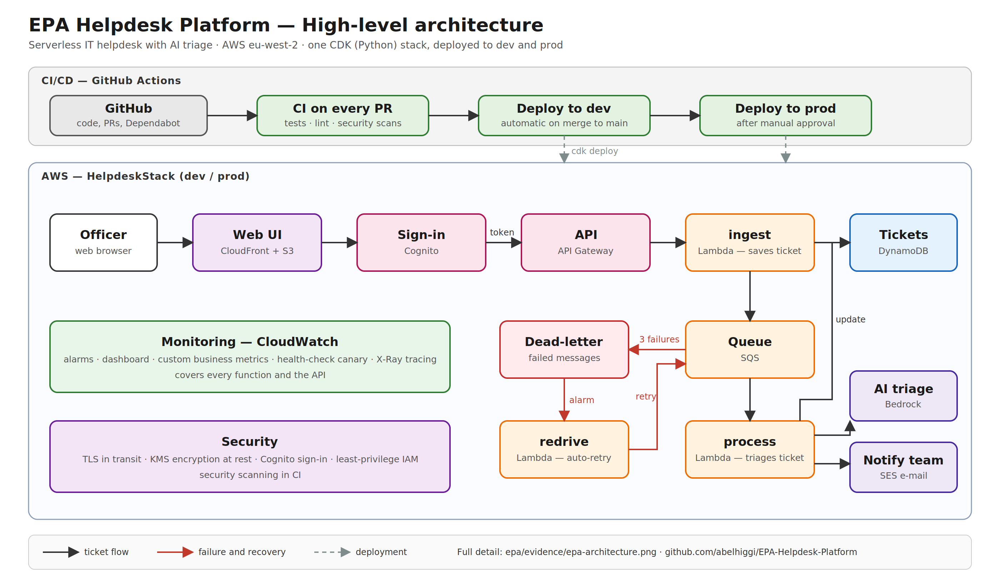
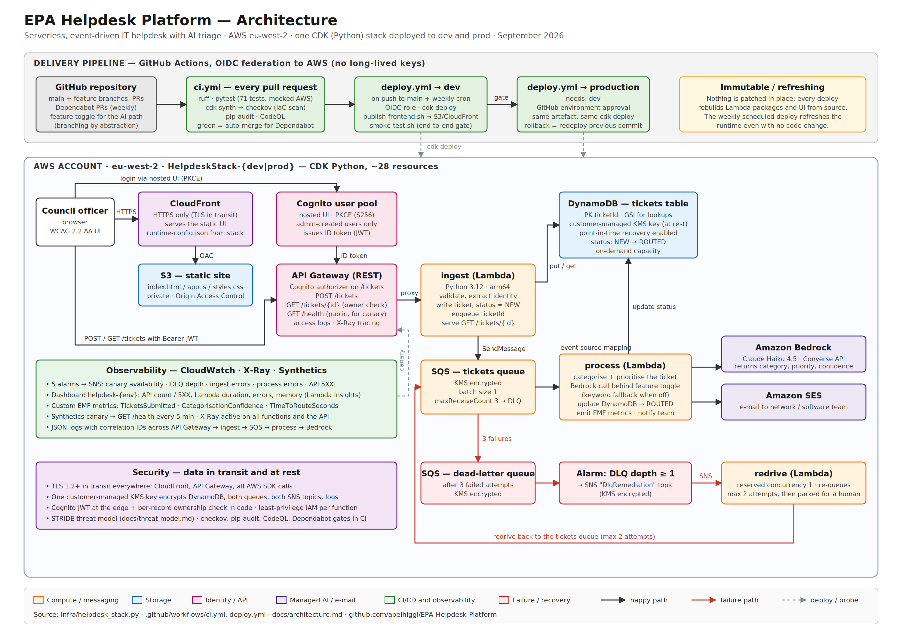

# Architecture

High-level view:

Full detail (every resource, all data flows)

Officer → CloudFront/S3 → Cognito → API Gateway → ingest → DynamoDB → SQS →
process → Bedrock / SES / metrics, with a DLQ and automated redrive on
repeated failure.

Observability: 7 alarms → SNS, 1 dashboard, X-Ray active on all functions.
Deployment: GitHub Actions → OIDC → cdk deploy → dev, then gated prod.

## Why this shape

**Event-driven, not synchronous.** Bedrock takes one to three seconds. Putting
that in the request path means the officer waits, and a Bedrock throttle becomes
a failed submission. The queue makes the API fast and makes AI failure
recoverable rather than user-visible.

**One stack, not six.** CDK resolves deployment order from the construct graph.
Splitting into stacks would require an orchestration layer to maintain and gains
nothing at 67 resources in prod (71 in dev).

**Three functions, not four.** `POST` and `GET` share validation, identity
extraction and table access, so they share a function. Splitting them would mean
two cold starts and two roles for forty lines of logic.

**Rollback is redeploying the previous commit.** CloudFormation already restores
prior state. A bespoke release-manifest and restore script is a second thing to
test, and a rollback path you never exercise is not a rollback path.

## Why DynamoDB, not RDS

The app only ever reads or writes one ticket by its ticketId. Ingest puts a
new item on POST and gets a single item on GET; process gets by ticketId and
updates the same item once triage finishes. There is also a GSI on status and
createdAt, added ahead of a staff view that lists tickets in order, though no
handler queries it yet. A single-key lookup with no joins is what DynamoDB is
built for, and pay-per-request billing means we pay nothing when nobody is
submitting tickets. RDS would have added a server to patch, a VPC to run it
in, and connection handling from three separate Lambdas, for an access
pattern that never needed a relational model. Point-in-time recovery is the
recovery plan for the table, and the table is encrypted with the stack's KMS
key.

## Trade-offs

**SQS batch size of 1.** A message either succeeds, or it retries and
eventually dead-letters on its own, with no partial-batch bookkeeping to get
wrong. The cost is throughput: each invocation handles one ticket instead of
many. That's fine at this volume.

**One Lambda asset shared by three handlers.** `src/` is one asset for
ingest, process and redrive, so `common.py` is importable by all three
without copying it into each build. The cost is a few unused KB per bundle,
and a change to any one handler moves the version of all three together.
That's acceptable while the three functions stay this small.

**Both environments in one AWS account.** Dev and prod are kept apart only by
resource naming right now. That's a sandbox constraint: the two environments
still share one account's IAM boundary and service quotas. The proper
pattern is one account per environment; see `docs/runbook.md`.
